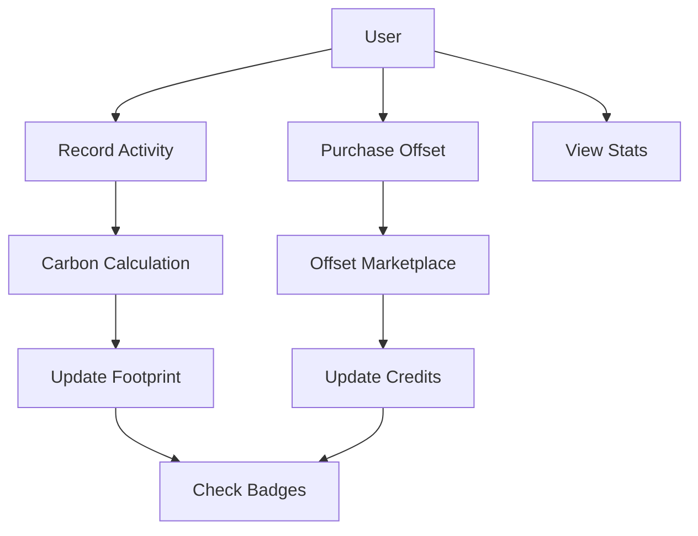

# Carbon Footprint Tracker

A decentralized solution for tracking, managing, and reducing carbon footprints through transparent blockchain verification.

## Overview

Carbon Footprint Tracker is a Clarity-powered application that enables individuals to:
- Record and track carbon-emitting activities
- Calculate their environmental impact
- Earn achievement badges for sustainable actions
- Purchase verified carbon offsets
- Maintain transparent, tamper-proof records of environmental impact

The system creates positive incentives for ecological responsibility while ensuring the authenticity of environmental impact claims through blockchain technology.

## Architecture

The smart contract system consists of a main contract that handles:
- Activity tracking and carbon calculations
- User footprint management
- Carbon offset marketplace
- Achievement badge system



## Contract Documentation

### Carbon Tracker Contract

The main contract managing all carbon footprint tracking functionality.

#### Key Components:

1. **Activity Tracking**
   - Records individual carbon-emitting activities
   - Categorizes activities (transportation, energy, food, etc.)
   - Calculates carbon impact

2. **Offset System**
   - Manages verified sustainability projects
   - Handles carbon credit purchases
   - Tracks user offset balances

3. **Achievement System**
   - Awards badges for sustainable milestones
   - Tracks user achievements
   - Verifies qualification criteria

## Getting Started

### Prerequisites
- Clarinet
- Stacks wallet
- STX tokens for offset purchases

### Basic Usage

1. **Record a Transportation Activity**
```clarity
(contract-call? .carbon-tracker record-transportation u100 "car" "Daily commute")
```

2. **Purchase Carbon Offsets**
```clarity
(contract-call? .carbon-tracker purchase-offset u1 u1000)
```

3. **Check Your Footprint**
```clarity
(contract-call? .carbon-tracker get-net-carbon-impact tx-sender)
```

## Function Reference

### Public Functions

#### Activity Recording
```clarity
(define-public (record-activity (category uint) (amount uint) (description (string-ascii 100)) (carbon-value uint)))
(define-public (record-transportation (distance uint) (mode (string-ascii 20)) (description (string-ascii 100))))
```

#### Offset Management
```clarity
(define-public (register-offset-project (name (string-ascii 100)) (description (string-ascii 500)) (price-per-ton uint) (initial-credits uint)))
(define-public (purchase-offset (project-id uint) (amount uint)))
```

#### Badge System
```clarity
(define-public (award-badge (user principal) (badge-id uint)))
(define-public (initialize-badge (badge-id uint) (name (string-ascii 50)) (description (string-ascii 200)) (requirement-type (string-ascii 20)) (requirement-value uint)))
```

### Read-Only Functions

```clarity
(define-read-only (get-footprint (user principal)))
(define-read-only (get-net-carbon-impact (user principal)))
(define-read-only (get-activity (user principal) (activity-id uint)))
(define-read-only (get-project (project-id uint)))
```

## Development

### Testing

1. Clone the repository
2. Install Clarinet
3. Run tests:
```bash
clarinet test
```

### Local Development
```bash
clarinet console
```

## Security Considerations

### Access Control
- Project verification should be restricted to authorized verifiers
- Badge awarding should be properly authenticated
- Activity recording is self-reported but immutable once recorded

### Limitations
- Carbon calculations are approximations
- Self-reported activities require trust in users
- Offset project verification needs strong governance

### Best Practices
- Verify project credentials before purchasing offsets
- Regularly monitor and audit carbon calculations
- Implement multi-signature requirements for critical operations
- Use conservative estimates for carbon impact calculations